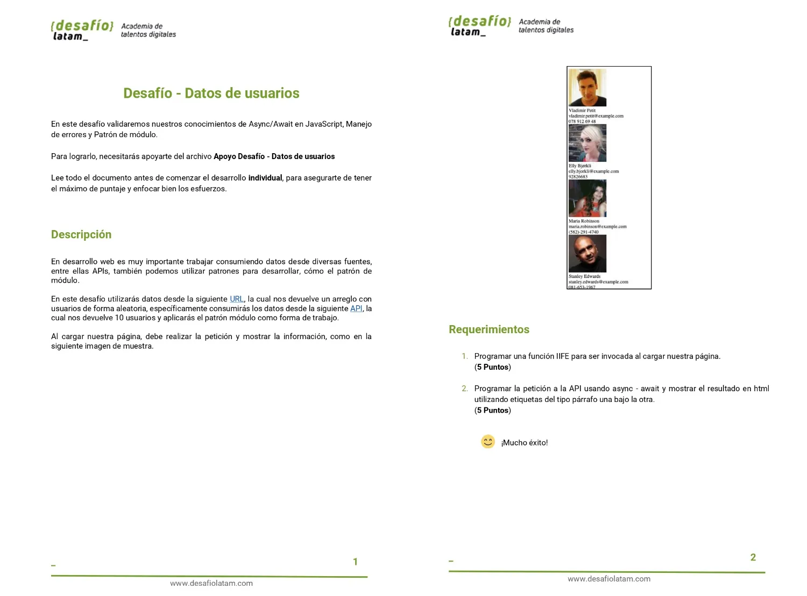
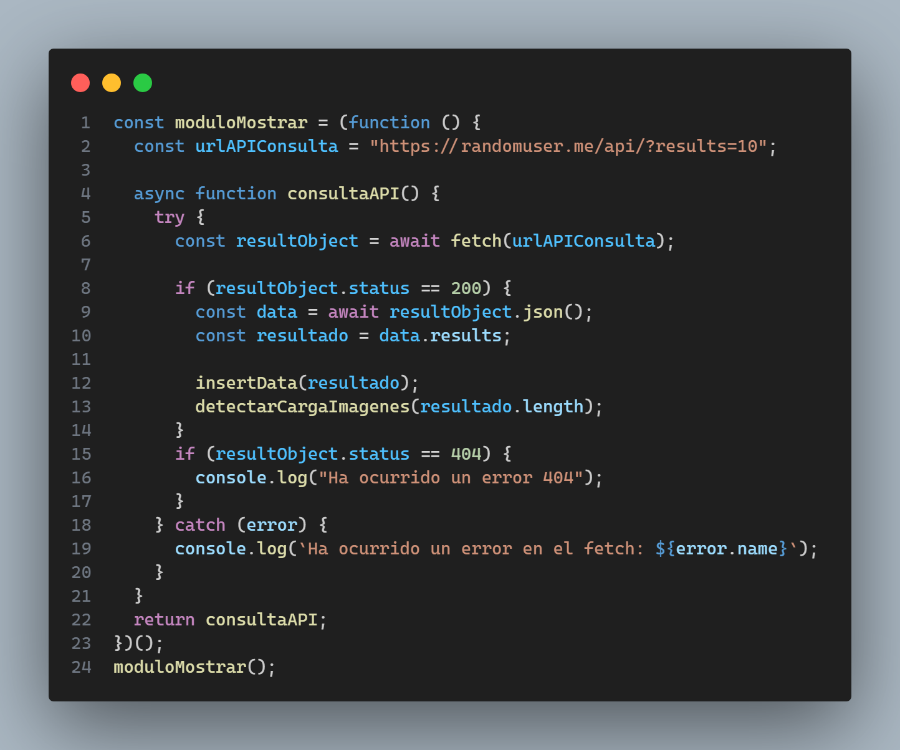

El presente repositorio contiene el código del séptimo desafío llamado **Desafío - Datos de usuarios** del módulo 4 **Programación avanzada en JavaScript** de la beca **Desarrollo de aplicaciones Full Stack Javascript Trainee** dictado por Desafío Latam. Los requisitos del proyecto son los siguientes:

Mi proyecto presenta dos estados: el estado inicial en el cual se esta cargando la data y el estado final en el cual la data ya ha sido cargada. A continuación muestro una screenshot del primer estado mostrando un loader en el área que se mostrará la data a modo de placeholder de peticiones asíncronas:

El estado final es aquel que muestra todas las imagenes:

A continuación muestro mis soluciones a las peticiones:

### 1.Programar una función IIFE para ser invocada al cargar nuestra página

He creado el siguiente patrón de módulo:

Dicho patrón de módulo lo ejecuto al cargar la página. El patrón de modulo lo he creado utilizando una función IIFE(Immediately Invoked Function Expression) la cual me permite encapsular código y hacerlo privado. Dicha función retorna la función privada **consultaAPI** la cual la invoco al cargar la página como muestro en la línea 24.

### 2.Programar la petición a la API usando async - await y mostrar el resultado en html utilizando etiquetas del tipo párrafo una bajo la otra

Para mostrar data de la API en el HTML he utilizado bootstrap 5, especificamente, el componente card. Para lo anterior he creado 3 funciones: **insertData**, **detectarCargaImagenes** y **toggleLoader**. La función **insertData** inserta la data en el HTML pero aún no es mostrada en pantalla. La función **detectarCargaImagenes** detecta cuando se han cargado **TODAS** las imagenes y cuando aquello se ha realizado entonces se muestra la data de la API llamando a la función **toggleLoader**. Esta última función no muestra el loader y muestra las cards con la data de la API que se desea mostrar.
